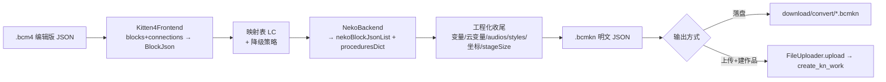

# 第二十轮方案 — 作品文件互相转化:Kitten <-> KittenN(KN)

日期:2026-09-24 · 基线:HEAD(库 `backend`) · 范围:`src/core/convert/*`(新增转化能力 + 把现有反编译栈 `compiler/unpacker/decoders` 收进该域的**结构重构**,见 §6.1)、`src/core.rs`、`README.md`、`docs/`、`tests/`

> 本轮**只出方案,不写实现代码**。逆向结论全部有出处:编辑器线上 bundle 的字节偏移、真实作品样例、以及真机跑通的转换实验(见 §11 与附录 C)。

---

## Context

### 需求

读取 `https://kn.codemao.cn/editor/`(KittenN 编辑器)里“把 Kitten / Nemo 作品转成 KN 作品”的那段 JS,在本库的基础上做一个**作品文件互相转化**能力;**第一步只做 Kitten <-> KN 两个编辑器**的双向转换(后续可扩 Nemo)。

### 现状(本库)

| 已具备                                                        | 位置                                                                                         |
| --- | --- |
| 作品抓取 + 解密 + 反编译(Kitten2/3/4、Coco、Neko、Nemo、Wood) | `src/core/compiler.rs`(门面)、`src/core/unpacker.rs`(引擎)、`src/core/decoders.rs`(各编辑器) |
| NEKO(`.bcmkn`)传输态解密(reversed-base64 + AES-256-GCM)       | `CryptoService` / `BCMKNDecryptor`,``unpacker.rs``                                     |
| Kitten 侧编辑器 JSON / Blockly XML 的**写出**能力             | `BlockDecompilerCore`(`decoders.rs`+)、`XmlBlockWriter`(`decoders.rs`)              |
| 作品 API(详情/源码/新建/发布/上传绑定)                        | `src/api/work.rs`(`create_kitten_work` 442、`create_kn_work` 608、`publish_*`)               |
| 文件上传(`FileUploader::upload` -> 公网 URL)                   | ``utils/requests.rs::PaginatedIter::next_item``                                                                     |

缺的正好是**反方向**:把编辑器 JSON/积木树重新组织成另一编辑器的作品文件。目前 `.bcmkn` 只有“解密 + 原样落盘”(`NekoDecompiler::decompile` 93-104),没有任何 Neko 积木树读写;Kitten 侧有积木树读写但只服务反编译,没有输出到 `.bcm4` 之外的形态。

### 逆向对象

| 产物                                                                                          | 说明                                                                                                                        |
| --- | --- |
| `base.f158ddbf.js` / `crc_libs.8196dbd1.js` / `main-vendors.9b801394.js` / `main.14802dc2.js` | 编辑器 4 个主 bundle,共 ~14.2 MB(webpack 5)                                                                                 |
| 107 个 `static/js/<id>.<hash>.chunk.js`                                                       | 懒加载 chunk(URL 表在 main 尾部 `__webpack_require__.u`,已完整取回)                                                         |
| **webpack module 41888**(在 `main-vendors` 内)                                                | 全部转换算法的所在地:`kittenBcmToNekoBcmUtils` / `nemoBcmToNekoBcmUtils` / `knBcmToText` / `textToKnBlockJson` + 积木配置表 |
| module 68602(`De`)+ chunk 2704 / chunk 2455                                                   | 触发链路与后处理(资源上传、变量/坐标改写)                                                                                   |

关键事实:**Kitten -> KN 的转换是纯客户端完成**的(没有转换服务端接口),所以算法可以被逐行移植。

---

## 1. 结论摘要

| 方向             | 输入                                     | 目标                | 官方实现                                   | 结论                                                                                          |
| --- | --- | --- | --- | --- |
| Kitten4 -> KN     | `.bcm4`(编辑版,`block_data_json`)        | `.bcmkn` JSON       | 已完成 `kittenBcmToNekoBcmUtils` + `De` 后处理 | **可完整移植**,编辑器自己就是这么做的(导入 `.bcm4` 弹“已自动转为KittenN作品”)                 |
| Kitten2/3 -> KN   | `.bcm`(编辑版,`blocksXML`)               | —                   | 判不做 无                                      | 编辑器明确拒绝:“暂不支持在KN打开Kitten作品,建议使用Kitten V4.0打开”;需先做 2/3 -> 4 的形态转换 |
| Nemo -> KN        | Nemo bcm(`blocksXML` + `actors_dict` 等) | `.bcmkn` JSON       | 已完成 `nemoBcmToNekoBcmUtils`(`gI`)           | 本轮不做,接口留好(§3.4)                                                                       |
| **KN -> Kitten4** | `.bcmkn` JSON(`nekoBlockJsonList`)       | `.bcm4` 编辑版 JSON | 判不做 官方无此方向                            | **需自建反向映射**;结构性可行(KN 积木名与 Kitten 同源),语义需按表差集裁剪并产出报告(§4)       |

一句话:**正向(Kitten4->KN)照抄官方算法即可对齐;反向(KN->Kitten4)是本项目要额外提供的价值**,也是风险集中处。

---

## 2. 文件格式规格

### 2.1 三种作品文件的顶层结构(真实样例核对过)

| 扩展名   | 编辑器     | 积木存放位置                                                                                                                                     | 顶层关键字段                                                                                                                                                                                                                                                                                                                                                                                                           |
| --- | --- | --- | --- |
| `.bcm`   | Kitten 2/3 | `theatre.{actors,scenes}.<uuid>.blocksXML`(Blockly **XML 字符串**)                                                                               | `width`/`height`(非 `size`)、`theatre.{scenes,actors,styles,scenes_order,current_scene,current_entity}`、`variables`、`variable_order`、`audio`、`toolbox`、`work_type:"KITTEN"`、`version:16`、`application_version:"3.8.17"`                                                                                                                                                                                         |
| `.bcm4`  | Kitten 4   | `theatre.{actors,scenes}.<uuid>.block_data_json`(**JSON 积木图**)                                                                                | `size:{width,height}`、`theatre.{scenes,actors,styles,groups,timer,videos,scenes_order}`、`variables`、`variable_order`、`cloud_variables`、`broadcasts`、`audio`、`midimusic`、`matrix`、`models`、`toolbox`、`toolbox_order`、`device_widget_type`、`sample_id`、`codemao_value`、`version:25`、`application_version:"4.11.x"`                                                                                       |
| `.bcmkn` | KN(Neko)   | `actors.actorsDict.<uuid>.nekoBlockJsonList`、`scenes.scenesDict.<uuid>.nekoBlockJsonList`、`procedures.proceduresDict.<uuid>.nekoBlockJsonList` | `stageSize:{width,height}`、`styles.stylesDict`、`variables.variablesDict`、`broadcasts.broadcastsDict`、`audios.audiosDict{sortList,currentAudioId}`、`scenes{scenesDict,currentSceneId,sortList}`、`actors.actorsDict`、`procedures.proceduresDict`、`projectName`、`version`(字符串,真机 0.13.0 / 0.27.1)、`toolType:"KN"`、`previewUrl`、`resourceZip`、`guideUrl`、`textToBlock`、`aiImageUrls`、`hidden_toolbox` |

样例出处:`download/compile/raw/春风得意-编辑版.bcm`(Kitten3)、`download/compile/raw/几何对战-联机.bcm4`(Kitten4)、`download/compile/HEX Editor_317683843.bcmkn`(KN 真实作品)、`https://creation.codemao.cn/neko/bcm/kn-default-v-0.13.1.bcmkn`(KN 空白模板,3.7 KB 明文)。

### 2.2 Kitten4 的 `block_data_json`(转换输入之一)

```json
{
  "blocks": {
    "mbLVLfoyuw4LflZD1uHo": {
      "type": "repeat_n_times", "id": "…", "comment": null,
      "is_shadow": false, "collapsed": false, "disabled": false,
      "deletable": true, "movable": true, "editable": true, "visible": "visible",
      "shadows": { "times": "<shadow xmlns=\"http://www.w3.org/1999/xhtml\" type=\"math_number\" id=\"…\" visible=\"visible\"><field constraints=\"1,Infinity,1,\" name=\"NUM\">20</field></shadow>", "DO": "" },
      "fields": { "sprite": "f1ea6dac-…" },
      "field_constraints": {}, "field_extra_attr": {}, "mutation": "",
      "is_output": false, "location": [334.44, 679.77], "parent_id": "…"
    }
  },
  "connections": { "<parentId>": { "<childId>": { "type": "next" | "input", "input_name": "…" } } },
  "comments": {}
}
```

- `blocks` 是 **id -> 积木对象** 的字典(不是 XML 字符串);`connections` 是父子邻接表,**根积木 = 从未作为子键出现的 id**。
- `shadows` 的值仍然是 **XML 字符串**(Kitten4 沿用 XML shadow),这点对双向转换很关键:影子在 KN 里也是同一套 XML 字符串。
- `connections` 实测 188 个积木 <-> 188 个条目(86 个非空),值形如 `{"type":"next"|"input","input_type":"value"|"statement","input_name":…}`;空对象 `{}` = 叶子节点。反向写 `.bcm4` 时 `blocks`/`connections`/`parent_id`/`location` **都要重建**。

### 2.3 KN 的积木 JSON(`nekoBlockJsonList` 元素)

三个生产者(Kitten 路径 `jC.parseBlock`、Nemo 路径 `hI.parseBlocksXML`、文本路径 `DC`)与一个消费者(`Ey` block->text)共用同一节点模型:

| 字段                                                                         | 类型                               | 说明                                                                              |
| --- | --- | --- |
| `type`                                                                       | string                             | KN 积木类型名(如 `on_running_group_activated`、`repeat_n_times`、`variables_set`) |
| `id`                                                                         | string                             | 积木 id;KN 用 `crypto.randomUUID()`(见 `gC`,`mod41888.pretty.js:74958`)           |
| `location`                                                                   | `[x, y]`                           | 工作区坐标(数字)                                                                  |
| `next`                                                                       | node                               | 下一个积木(single)                                                                |
| `inputs`                                                                     | `{slot: node}`                     | 值输入(`input_value`)                                                             |
| `statements`                                                                 | `{slot: node}`                     | 语句槽(`input_statement`,`DO`/`DO0`/`STACK`/`ELSE`…)                              |
| `fields`                                                                     | `{name: value}`                    | 字段(下拉、实体引用 id 等)                                                        |
| `shadows`                                                                    | `{slot: xmlString}`                | 每个输入的 shadow(XML 字符串;空串 `""` 表示占位)                                  |
| `mutation`                                                                   | string                             | mutation XML(`<mutation xmlns="http://www.w3.org/1999/xhtml" …>`)                 |
| `is_shadow` / `is_output` / `shield` / `disabled` / `deletable` / `editable` | bool                               | 渲染/行为标志                                                                     |
| `field_constraints`                                                          | `{field: {min,max,precision,mod}}` | 数字输入约束(相机/变量等场景)                                                     |
| `parent_id`                                                                  | string                             | 反向引用(可选)                                                                    |

程序集在 KN 里是**独立实体**,不在 `nekoBlockJsonList` 中重复:

```json
"procedures": { "proceduresDict": { "<procId>": {
  "id": "…", "name": "函数_数_字符_5", "type": "NORMAL" | "ROUND",
  "params": [ { "id": "…", "type": "Label" | "String", "name": "字符串" } ],
  "nekoBlockJsonList": [ { "type": "procedures_2_defnoreturn", "fields": { "NAME": "<procId>" }, "inputs": { "PARAMS1": {…} }, "statements": { "STACK": … }, "mutation": "<mutation xmlns=…><arg id=… name=… type=…></arg></mutation>" } ],
  "comments": {}, "workspaceScrollXy": { "x": 100, "y": 30 }
} } }
```

### 2.4 加密/传输差异(容易踩坑)

| 形态                                                      | 是否加密                                                                                                               | 依据                                                                             |
| --- | --- | --- |
| `.bcmkn` 经 NEKO 播放器详情接口取回                       | **是**:reversed(base64-STANDARD) -> `IV(12) ‖ AES-256-GCM(明文 JSON)`;key = `SHA256(salt)`,`salt = 0x00..0x1E`(31 字节) | ``unpacker.rs``;本库已实现并真机验证                                       |
| `.bcmkn` 落盘(反编译产物)、CDN 模板、编辑器本地导入的文件 | **否**,明文 JSON                                                                                                       | `NekoDecompiler::save_result`(`decoders.rs`);`kn-default-*.bcmkn` 实测明文 |
| `.bcm/.bcm4`(Kitten 播放器 `player/load` 或编辑版文件)    | **否**,明文 JSON                                                                                                       | ``decoders.rs``;本库无 Kitten 侧加密代码                                   |

> KN 编辑器导入 Kitten 作品时,会把**原始 Kitten 文件字节**作为 `bcm4` Blob 重新上传,并把 URL 写成 KN 作品的 `source` 字段(即“保留原件”)。这是官方做法,建议本项目照抄(见 §3.1、§6.4)。
>
> **编辑器自身不做作品文件加解密**:对 4 个主 bundle + 107 个 chunk 全文检索 `AES / CryptoJS / decrypt / encrypt / subtle / forge` 只命中 vendored 库的内部标识与 `crypto.getRandomValues`(随机 UUID),没有任何文件级加解密代码;默认作品、`.bcm4`、`.bcmkn` 都被直接 `JSON.parse`。也就是说:**加密只出现在 NEKO 播放器详情接口返回的 `source_urls[0]`**(本库已实现解密),编辑器/本地导入链路看到的都是明文。

---

## 3. 编辑器侧官方转换实现(逆向结论)

### 3.1 触发链路

**本地文件导入**(`chunks/2455.fff7df4c.chunk.js`,UploadDragger;文件后缀分组:`Et=["bcm","bcmp"]`,`Pt=["bcm4","bcmp4"]`,`Dt=["bcmkn","bcmknk","bcmknh"]`,byte 45200 附近):

| 后缀                  | 行为                                                                                                           | 证据             |
| --- | --- | --- |
| `bcmkn/bcmknk/bcmknh` | 直接打开(`jt.BE(file)`)                                                                                        | byte 53207-53280 |
| `bcm4/bcmp4`          | **自动转换** `jt.R7(file)`,成功后 toast「已自动转为KittenN作品」                                               | byte 53207-53320 |
| `bcm/bcmp`            | 弹窗「无法打开作品 / 暂不支持在KN打开Kitten作品,建议使用Kitten V4.0打开」,确认按钮「打开 V4.0」-> `window.open` | byte 53320-53400 |

**打开 K 作品的主流程**(`chunks/2704.ec059467.chunk.js`,函数 `re(r, n)`,byte 27537):

```js
i = await S.dA(r);                     // 读文件/URL 文本
p = JSON.parse(i);                     // Kitten 编辑版 JSON
loading('header.parsing_k_bcm_loading');// 文案 "Parsing kbcm"
l = await import(/* 41888 */);
w = n ? l.kittenBcmToNekoBcmUtils(p) : p;         //  核心转换(第 2 参数=false 时跳过,即“已是 KN”分支)
w = await d.HandlerApi.kittenBcmToNekoBcm(b.aA, w); //  后处理:资源/变量/坐标/stageSize
m = new Blob([i], { type: k.E.BCM4 });             // 原始 Kitten 文件
T = (await d.ServiceApi.uploadUserFiles([m]))[0];
w.source = '' + T;                                 // 原件 URL 挂到 KN 作品上
if (!v.BcmHelpers.validateBcm(w)) { /* 弹「作品被损坏,打开失败」 */ }
```

注意:`HandlerApi.kittenBcmToNekoBcm` 这个名字是误导——它是 `main.14802dc2.js` module 68602 里的本地函数(`De`,byte 17836),**不发网络请求**。

### 3.2 核心:`kittenBcmToNekoBcmUtils`(`GN`,`mod41888.pretty.js:82815`)

```
GN(kittenBcm)
├─ UC = size.width > size.height                        // 横屏标志(模块级全局,GC 里做坐标换算用)
├─ r = new jC(kittenBcm)                                // Kitten 专用积木适配器
├─ for scene in theatre.scenes:  procedures += zC(HC(scene, r))   // HC: 解析积木;zC: 收集程序集
├─ for actor in theatre.actors:  procedures += zC(HC(actor, r))
├─ e.procedures = { proceduresDict: procedures }
├─ theatre.actors  = mapValues(a => KC(omit(a, [block_data_json,user_change_r_c,editable_in_tuition_mode]) ⊕ cloneDeep(a), procedures))
├─ theatre.scenes  = mapValues(s => KC(omit(s, [block_data_json]) ⊕ cloneDeep(s), procedures))
└─ e.broadcasts = { broadcastsDict: <原 broadcasts> }    // 只包一层
```

逐个子过程(全部在 `mod41888.pretty.js`,行号即锚点):

> 注意: **这一步只是阶段 1**:`GN` 的产物**不是合法 `.bcmkn`**(官方 `BcmHelpers.validateBcm` 会报 `actorsDict 不存在`,实测见 §11.1)——它保留了 `theatre.*`/`size`/`project_name` 等 Kitten4 结构,必须再跑 §3.3 的后处理把 `theatre.*` 重排成 `actorsDict/scenesDict/stylesDict/variablesDict/stageSize/projectName`。移植时这两步要么串起来,要么在一个 Rust 函数里一气呵成。

| 符号           | 行                | 职责                                                                                                                                                                                                                                                                                                                                                                   |
| --- | --- | --- |
| `jC`           | 77361             | Kitten 积木适配器。`parseBlock({blocks, connections, comments})`(77578)把邻接表拍平成节点树:根 = 未被引用者;`connections` 里 `type:"next"` -> `node.next`,`type:"input"` -> `node.inputs[input_name]`                                                                                                                                                                    |
| `jC` 子表      | —                 | `specialFieldValueMap`(77465,字段值改写如 `sprite.__self -> "--self"`、`attribute.0 -> "x"`);`getMappedName`(77497,输入名改写:如 `procedures_2_defnoreturn.PROCEDURES_2_DEFNORETURN_MUTATOR->PARAMS0`);`mapFieldName`(77749);`mapFieldValue`(77738);`transformShadowXml`(77815);`translateBlockType`(77840);`createMutationForBlockType`(78303)                           | <!-- hygiene-allow: 标识符示例,非凭据 -->
| `HC`           | 78421             | 取 `block_data_json` -> `jC.parseBlock` -> 过滤 `type===""` -> 拆出 `procedures_2_defnoreturn` 为 `procedureBlocks`,其余写入 `e.nekoBlockJsonList`                                                                                                                                                                                                                        |
| `zC`           | 78481             | 每个程序集定义 -> `proceduresDict[procId] = {id,name,type,params,nekoBlockJsonList}`;`inputs.PARAMS*`(`procedures_2_stable_parameter`,按序号排序)-> `params[]`;`inputs.STACK` -> `statements.STACK`;合成 `<arg …/>` mutation;`deletable/editable=false`;**若含返回值(`ZC`,78385)则额外产出一条 `ROUND` 包装条目**(`VC` 78441 补默认 `VALUE` 输入 + `WC` 78473 从主体剥离) |
| `KC`           | 78577             | 重写所有 `procedures_2_callnoreturn/callreturn`:把 `fields.NAME`(源程序集**名**)换成目标**id**,并重建 `mutation def_id/name/type` + 每个参数 `<arg>`(String 参数额外把 `ARGn` 输入换个父并把默认 shadow 换成 `math_number`);找不到同名程序集就原样保留                                                                                                                 |
| `GC`           | 78639             | 单节点特例:横屏下 `self_move_to/self_glide_*` 坐标包一层 `math_arithmetic divide 1.3`;`set_camera_alpha`->`minus 100`;`shadow_number`->`math_number` 或文本占位;`list_append(POS:first)`/循环体内 `play_audio` 降级为文本占位 + `disabled:true`                                                                                                                          |
| `LC`           | 76737             | **Kitten -> KN 积木名映射表**(`translateBlockType` = `LC[e]                                                                                                                                                                                                                                                                                                             |     | e`)。例:`start_on_click->on_running_group_activated`、`self_on_tap->sprite_on_tap`、`controls_if_no_else->controls_if`、`set_costume->set_sprite_style`、`get_current_costume->get_styles`、`self_disappear->self_appear`、`get_3->appearance_of_sprite`、`lists_append->list_append`、`shadow_text->text_join`、`default_value->math_number` |
| `RC` / `oI`    | 77103 / 79157     | mutation 里的人类可读标题文本(中文),如 `RC.dispose = "删除自己"`                                                                                                                                                                                                                                                                                                       |
| `MC`           | 76734             | 程序集类型枚举 `NORMAL/HEXAGONAL/ROUND`                                                                                                                                                                                                                                                                                                                                |
| `yp`/`_h`/`kh` | 17368/17784/17819 | lodash `cloneDeep` / `mapValues` / `omit`                                                                                                                                                                                                                                                                                                                              |

**降级策略(重点)**:所有 Kitten 独有而 KN 不支持的积木(`dispose`、`self_flip`、`check_screen`、`microbit_*`、`physics2_*`、`WIDGET_LVMI_*`、`auto_player_*` …)在 `LC` 里被映射成**文本占位积木**:`bcm_translator_text_execution_block` / `_event_block` / `_return_value_block` / `_return_boolean_block`。`jC.parseBlock` 会给它们置 `disabled:true` + `shadows:{TITLE_HEAD:""}` + 带中文标题的 `<mutation items="">…</mutation>`(77625-77627)。**没有任何积木会被静默丢弃**,信息保存在 mutation 文本里。

### 3.3 后处理:`De`(`main.14802dc2.js` module 68602,byte 17836)

对 §3.2 的输出做“工程化收尾”,全部在浏览器内完成:

1. `audios.audiosDict` <- 逐个补 `{id,name,url,ext}`,`sortList` <- 原 `audio_order`,并给出 `currentAudioId`;
2. `styles.stylesDict`:对每个造型图片 `fetch -> blob`,**必要时重新上传**(`ServiceApi.uploadUserFiles`)并把 `center_point/rotate_center` 归一成 `centerPoint`;
3. 坐标换算 `b(x,y,w,h,W,H) = { x:(x + w/2) * W/w, y:(H/2 - y) * H/h }`,把 Kitten 的舞台坐标/尺寸换算到 KN 的 `562×900`(或横屏 `900×562`);
4. `variables.variablesDict` <- Kitten `variables` 数组:`name/value/visible/position/isGlobal(<-is_global)/createTime/scale/currentEntityId(<-current_entity)`,**样式图标**由 `theme` 决定:`score->ICON_MEDAL`、`HP->ICON_HEART`、`clock->ICON_HOURGLASS`、`coin->ICON_COIN`、`pure->TEXT`、其他 `DEFAULT`;
5. `cloud_variables` -> 全局变量(`private->type:"any"`, `public_list->type:"list"`,初值 `[]`/`0`);
6. `stageSize`(按原画布长宽比归一为 `562×900`/`900×562`)、`projectName`(缺省「空白作品」)、`toolMode`、`isHideStage`、`broadcasts`、`procedures` 落位;
7. 不做:积木树本身(由 §3.2 完成)、`.bcm`(Kitten2/3)`blocksXML`(编辑器直接拒绝,见 §3.1)。

### 3.4 Nemo -> KN 路径(`gI` = `nemoBcmToNekoBcmUtils`,`mod41888.pretty.js:81038`)

本轮不实现,但同一条流水线以后必然要接,先把结构记下:

- 输入是 Nemo `.bcmkn` 快照 JSON:`actors.actors_dict`、`scenes.scenes_dict`、`scenes.scenes_order`、`variable.variable_dict`、`broadcast.broadcast_dict`、`audios.sounds`、`styles.styles_dict`、`procedures.procedure_dict`、`split_options`、`stage_size`、`toolbox.devices`,每个 actor/scene/procedure 带 `blocksXML`(**Scratch 风格 XML**)。
- 先跑**版本迁移**:`rI/tI` + `{ "0.9.3": QC, "0.14.0": YC }`,逐级升到 `qC.bcm_version = "0.16.2"`(78808/78918/78925);`QC`:0.9.3->0.9.4(负向旋转、audio 积木 field->shadow、变量重定位);`YC`:0.14.0->0.15.0(给 `controls_if` 补 `<mutation else="1">`)。
- 再由 `hI`(Nemo XML 解析器,79225)把 `blocksXML` 解析成**与 §3.2 完全相同的 KN 积木 JSON**,同时用 `sI`(78943)别名表 + `specialFieldValueMap`(79239)+ `getMappedName`(79330)做旧名迁移。
- 最后按 Nemo 字段名重建 KN 对象(`h`)。

### 3.5 文本层:`knBcmToText` / `textToKnBlockJson`(积木 <-> 中文文本)

这是编辑器里“代码视图”的实现,对本项目的价值是**调试与人工校验通道**(双向都实测通过):

| 接口                       | 真实签名(实测纠正)                                     | 行为                                                                                                                                  |
| --- | --- | --- |
| `knBcmToText` (`zN`)       | `knBcmToText(bcm, commentsMap)` -> **实例**             | 调 `.parsesBcmToMarkdown()` 得 Markdown:`# <场景名>:` / `## <角色名>:` + `### 属性:`(JSON)+ `### 代码:`(```codemao 围栏)              |
| `textToKnBlockJson` (`KN`) | `textToKnBlockJson(bcm, entity, text)` -> `BlockJSON[]` | Babel(flow 插件)解析 -> 逐 AST 节点生成积木 JSON;**程序集不在返回值里**,落在 `BlockGenerater` 的 side table(`bcmAddedData.procedures`) |

实测要点:

- 文本语法是**JS + 箭头回调**:`当开始运行(() => { 打印("你好"); });`、`重复循环(10, () => {…});`、`if (a === 1) {…}`(注意 `if` 用原生 JS 写法,不是 `如果(...)`)。
- 词表 `chineseNameDict`(`Jm`,32666)**208 条**中文 token <-> 积木类型;`blocksOptions`(`$m`,~33300)是积木签名表(参数名/类型/默认 shadow);`shadowDict`(`cy`,35764)是 shadow XML 模板。
- **未知 token 不报错**:降级为 `bcm_translator_text_*` 占位积木,原文塞进 `<mutation items="N">…</mutation>`。反向(block->text)才会抛 `"<type> 属于未知指令"`(36045)。
- **往返无损(实测)**:KN 真实作品(HEX Editor,3.7 MB、55 种积木、359 个节点)经 block->text->block 后,积木类型多重集 **359 = 359 完全一致**;差异仅为编辑器元数据(id/location/parent_id/workspaceScrollXy)、shadow XML 归一化(丢 `xmlns`/`id`、约束字面量回默认)、变量/程序集换新 UUID——即**结构无损、书签性字段不可复现**。

### 3.6 版本常量与实际文件的差距

- 模块内目标版本常量是 `"0.16.2"`(`qC`,78808),迁移表只处理 `0.9.3`/`0.14.0`;
- 真实作品见到 `0.13.0`(空白模板)、`0.27.1`(HEX Editor);`0.27.4` 在模块里**不存在**;
- `GN` **不写任何版本字段**(只改结构),编辑器后续由自身逻辑补;因此本项目的产物必须显式选择写入 `version`(建议跟随当前线上模板,或保留源作品的 `version`)。

---

## 4. KN -> Kitten4(反向)可行性分析

官方**没有**反方向实现(Kitten 编辑器不接受 `.bcmkn`,KN 编辑器也不导出 `.bcm`)。因此反向映射必须自建,策略如下。

### 4.1 结构层面完全可行

- 两代积木**同源**(Blockly 血统):`controls_if`、`math_number`、`procedures_2_*`、`variables_set`、`repeat_n_times` 等在两侧同名,`LC` 表里大量条目是 identity(`repeat_forever->repeat_forever`、`procedures_2_callnoreturn->procedures_2_callnoreturn` …);
- Kitten4 的 `block_data_json` 与 KN 的积木 JSON 是**同一信息模型的不同编码**:Kitten4 = 邻接表(`blocks` + `connections` + `parent_id` + `location`),KN = 树(`next`/`inputs`/`statements`)。图<->树互转本身**结构无损**;但要注意官方树编码**没有槽位装渲染性字段**(实测 `GN` 丢掉 `collapsed/disabled/movable/visible/field_extra_attr/comment`、加上 `shield/next/inputs/statements`),所以本项目的 `BlockJson` 必须**额外保留原始键**(见 §6.2 逃生舱),否则往返会丢这些属性。
- 影子:两侧都是 XML 字符串(`shadows[slot]`),可直接搬运;
- 程序集:KN 的 `proceduresDict` 条目 <-> Kitten4 的 `procedures_2_defnoreturn` 根积木(`fields.NAME` 用名字,`PARAMS*` 输入 + `<arg>` mutation),可逆。

### 4.2 语义层面需要表差集

反向表 = `LC` 反转(`sI` 可作为交叉校验)后,逐条判定:

| 类别                   | 例子                                                                                                                                      | 反向策略                                                                                                         |
| --- | --- | --- |
| 同名(identity)         | `repeat_forever`、`controls_if`、`procedures_2_*`                                                                                         | 直通                                                                                                             |
| 有 KN->Kitten 名字      | `on_running_group_activated->start_on_click`、`set_sprite_style->set_costume`、`get_styles->get_current_costume`、`list_append->lists_append` | 查表                                                                                                             |
| 文本占位积木(降级来的) | `bcm_translator_text_execution_block` 等 4 种                                                                                             | **不可逆**:从 `<mutation>` 取原文,决定 (a) 生成注释积木 + 报告,或 (b) 丢弃 + 报告,或 (c) 报错阻断(`strict` 模式) |
| KN 独有积木            | 需统计(KN 的 `$m` 词表 − `LC` 值域)                                                                                                       | 默认丢弃 + 报告;命中白名单(如 `switch_to_screen`)可手工映射到 Kitten4 同名/近似积木                              |
| 资源/变量语义          | 变量样式图标、云变量、`stageSize`                                                                                                         | Kitten4 变量模型无 `style/position` 概念 -> 丢弃并报告                                                            |

> “KN 独有积木清单”不能靠肉眼看:§7 Phase 0 会写一个只读统计脚本,把 `$m`/`Jm`/`LC`/`sI` 导出成 JSON 后做集合差,得到确定的差集(以及社区真实作品的积木频次,用来判断“值不值得映射”)。

### 4.3 目标文件形态选择

| 候选                                  | 优点                                                                            | 缺点                                                       | 结论                     |
| --- | --- | --- | --- |
| Kitten4 **编辑版**(`block_data_json`) | 与编辑器“打开本地文件/KN 导入流”吃的格式一致(§3.1);本库已能读写该形态的邻居格式 | 需要自己维护 `connections` 邻接表与 `location` 布局        | **推荐**                 |
| Kitten4 **编译版**(`compile_result`)  | `ts2kitten` 证明可行,播放器/编辑器都能吃                                        | 需要复刻编译器的 `params/child_block/conditions` 约定,更脆 | 备选(导出给播放器时再做) |
| Kitten2/3(`blocksXML`)                | 老作品回迁                                                                      | 需再做一轮 4->3 映射,收益低                                 | 不做                     |

---

## 5. 本库现状与复用边界(改造清单)

> 下表路径是**重构前**的现状(HEAD);重构后按 §6.1 迁移:`core/compiler.rs -> core/convert/decompile/mod.rs`、`core/unpacker.rs -> core/convert/shared/*`、`core/decoders.rs -> core/convert/decompile/editors/*`。功能实现以重构后的路径为准。

| 复用                                              | 位置                                                                       | 需要做什么                                                                          |
| --- | --- | --- |
| `EditorType`(原 `WorkType`,7 编辑器判别)、`file_extensions` | ``unpacker.rs``、``unpacker.rs``                        | 直接复用;公开名改 `EditorType`(见 §6.1);`convert` 内部按 `WorkType` 分派                                           |
| `CryptoService` / `BCMKNDecryptor`                | ``unpacker.rs``                                                      | 直接复用(读 `.bcmkn` 加密源);**需要新增加密函数**(反向写回传输态时用)               |
| `FileService::safe_filename` / `write_json`       | ``unpacker.rs``                                                      | 复用命名与落盘                                                                      |
| `ShadowBuilder`、`BlockContext`、`XmlBlockWriter` | ``unpacker.rs``、``decoders.rs``                              | Kitten 侧影子/XML 生成可复用;**但 Kitten4 走 JSON 而非 XML**,需新增 JSON 连接表写出 |
| `KittenDecompiler` 的 `block_data_json` 生成逻辑  | ``decoders.rs``、``decoders.rs``                             | 反向时作为**格式参照**(块字段清单/字段约束/连接结构)                                |
| API 层:新建/发布/上传                             | `api/work.rs::create_kitten_work/create_kn_work`、``utils/requests.rs::PaginatedIter::next_item`` | 复用;转换产物经 `FileUploader::upload` 拿 URL 再建作品                              |
| 模块可见性                                        | `core.rs`(`decoders`/`unpacker` 是 `pub(crate)`)                           | 新模块放 crate 内;对外只经 `core::convert` 门面暴露                                 |

---

## 6. 方案设计

### 6.1 域结构:把反编译栈与转化能力一起收进 `convert`(先做的重构)

> 本节是**结构重构方案**:允许大规模搬迁,但要求**零行为变更**(只搬文件与改可见性,不改签名、不改逻辑)。它先于功能实现落地;功能方案从 §6.2 起。
> **2026-09-25 更新(第二十一轮收敛后,见 `docs/rounds/21-convert-domain-consolidation-plan.md` §8.2)**:
> 本节的目录树是第二轮重构(域化)时的布局,此后文件已合并 —— `shared/` 9 -> 5(`infra/model/config/error/mod`)、
> `decompile/{context,contract}` 并入 `decompile/mod.rs`、`blocks/` 三文件 -> `blocks.rs`、
> `editors/kitten/` 三文件 -> `kitten.rs`、`editors/{coco,neko,wood}` -> `simple.rs`、
> `translate/{report}` 并入 `mod.rs`、`{blockjson,ids}` -> `model.rs`、`{finish,kitten4_finish}` -> `assembly.rs`。
> 生产文件 34 -> 18。**当前布局以 docs/rounds/21 §8.2 为准**,下表的"重构前/重构后"对应关系仍然有效。

> 重构后 `convert/` 成为**作品文件转换域**的唯一边界:读(反编译)与写(互相转化)共用一套地基,域外不再有平铺的 `compiler.rs` / `unpacker.rs` / `decoders.rs`。

#### 现状与判定标准

| 现文件             | 行数 | 装了什么                                                                                                                               | 问题                                                                        |
| --- | --- | --- | --- |
| `core/compiler.rs` | 369  | 反编译门面:`DecompileOptions`、`CodemaoDecompiler`、`WorkProcessorRegistry`、`decompile_*`                                             | 名字叫 compiler,干的却是 decompile;与 `api/` 里"作品"概念的同名/近名混淆    |
| `core/unpacker.rs` | 1328 | 引擎地基:错误 / 配置(含影子模板大表)/ `WorkType`(-> 公开为 `EditorType`)/ `WorkId` / `WorkInfo` / 文件 / ID / 加密 / 影子 / 积木上下文 / 上下文 / 契约 / HTTP | 六件事挤一个文件;转化功能要从里面"挑着用"                                   |
| `core/decoders.rs` | 2490 | 5 个编辑器 fetcher+decompiler(Kitten 另带 `XmlBlockWriter`)+ 通用积木反编译核心 + 9 个特例 + 工厂                                      | 一文件 5 编辑器两层框架;改一个编辑器要在 2500 行里翻,新增转化又要复用积木树 |

判定"是否属于本域"的唯一标准——**是否读写作品文件 / 积木树 / 作品资源**:

- **属于**:抓取、解密、反编译、编辑版 JSON/XML 读写、编辑器间重排、作品资源上传。
- **不属于**(保持现状,不加抽象):`cloudvar`(云变量 WS)、`converse`(AI 对话 WS)、`pipeline`/`registry`/`retrieve`/`services`(举报引擎)、`terminal`(演示 UI)、`utils/socketio`(WS 基础设施)。

#### 目标结构

```
src/core/convert/                  # 作品文件转换域(读写作品文件的唯一边界)
├── mod.rs                  ~40    # 域门面:域文档 + pub mod decompile/translate + 跨子域类型再导出
├── shared/                        # 两子域共用的地基(pub(crate),不对外)
│   ├── mod.rs              ~30    # pub(crate) use 汇总
│   ├── error.rs            ~55    # DecompilerError / Result / ResultExt
│   ├── json.rs             ~85    # ValueExt
│   ├── config.rs           ~410   # DecompilerConfig + ShadowTemplate(含影子模板/字段大表)
│   ├── model.rs            ~145   # EditorType(原 WorkType)/ WorkId / WorkInfo(编辑器判别、扩展名表)
│   ├── files.rs            ~80    # FileService / IdGenerator(命名、落盘)
│   ├── crypto.rs           ~100   # CryptoService / BCMKNDecryptor(.bcmkn 加解密,读+写共用)
│   ├── http.rs             ~55    # HttpClient / CodeMaoHttpClient
│   └── fetch.rs            ~30    # RawWorkData / WorkFetcher(按作品 id 抓原始文件)
├── decompile/                     # 反编译(读:作品 → 编辑版 JSON / 源码树)
│   ├── mod.rs              ~380   # 门面:CodemaoDecompiler / DecompileOptions / WorkProcessorRegistry / decompile_*
│   ├── contract.rs         ~70    # WorkDecompiler / DecompileResult / save_json_result / save_path_result
│   ├── context.rs          ~80    # DecompilerContext + DecompilerContextBuilder
│   ├── shadow.rs           ~145   # ShadowBuilder(按 config 的影子模板造 XML/JSON shadow)
│   ├── blocks/                    # 通用积木反编译(与编辑器无关的部分)
│   │   ├── mod.rs          ~120   # BlockDecompilerBehavior / BlockBehavior / BlockContext
│   │   ├── core.rs         ~355   # BlockDecompilerCore(递归骨架、影子推断、连接表写入)
│   │   └── special.rs      ~510   # BlockDecompiler trait + 9 个特例 impl + 工厂
│   └── editors/                   # 一个编辑器一个文件(注册表在 mod.rs 接入)
│       ├── mod.rs          ~60
│       ├── kitten/                # Kitten2/3/4(最大的一个,按职责再分)
│       │   ├── mod.rs      ~230   # KittenFetcher + WorkDecompiler impl + 公共字段恢复
│       │   ├── decompiler.rs ~360 # 编译版积木树 → 编辑版 block_data_json
│       │   └── xml.rs      ~205   # XmlBlockWriter(Kitten2/3 的 blocksXML 序列化)
│       ├── neko.rs         ~90    # NEKO(.bcmkn):抓取 + 解密落盘
│       ├── nemo.rs         ~285   # NEMO:抓取 + 目录树重组 + 资源
│       ├── coco.rs         ~225   # COCO
│       └── wood.rs         ~205   # WOOD
└── translate/                     # 互相转化(写:编辑版 ⇄ 编辑版)
    ├── mod.rs              853    # 门面:TargetEditor / TranslateOptions / TranslateReport / translate_file + 管线 + 差分测试
    ├── blockjson.rs        368    # 中核积木节点(图↔树工具、null 容错、浮点往返)
    ├── ids.rs               99    # id 生成(UUID / 短 id;确定性模式供对齐/回归)
    ├── kitten.rs           465    # Kitten4 前端(邻接表 → 树)+ 反向后端(树 → blocks/connections)
    ├── mapping.rs         1922    # 语义映射双向:LC 改名、字段/输入/影子改写、GC 特例、降级、反查表
    ├── neko.rs            1250    # KN 侧:zC/KC 与逆向、积木树 ⇄ JSON
    ├── finish.rs          1211    # 正向 KN 文档装配(实体/变量/云变量/样式/音频/画布/版本)
    ├── kitten4_finish.rs   666    # 反向 Kitten4 文档装配(与 finish 对称)
    ├── reverse_tests.rs   1088    # 反向与往返测试(独立文件,避免门面膨胀)
    ├── tables_gen.rs      1664    # // @generated:由编辑器 bundle 生成的表(LC/RC/shadow/类型集/常量)
    └── report.rs           139    # 覆盖率 / 降级 / 丢弃 报告
```

**逐块搬迁对照表**(行区间以当前 HEAD 为准,搬迁时逐段剪切,不改代码):

| 目标文件                                 | 来源                                                                                   | 预估行 |
| --- | --- | --- |
| `convert/mod.rs`                         | 新增(域门面)                                                                           | ~40    |
| `shared/mod.rs`                          | 新增(pub(crate) 汇总)                                                                  | ~30    |
| `shared/error.rs`                        | ``unpacker.rs``                                                                    | 53     |
| `shared/json.rs`                         | ``unpacker.rs``                                                                   | 83     |
| `shared/config.rs`                       | ``unpacker.rs``                                                                  | 408    |
| `shared/model.rs`                        | ``unpacker.rs``                                                                  | 145    |
| `shared/files.rs`                        | ``unpacker.rs``                                                                  | 77     |
| `shared/crypto.rs`                       | ``unpacker.rs``                                                                  | 97     |
| `shared/http.rs`                         | ``unpacker.rs``                                                                | 55     |
| `shared/fetch.rs`                        | ``unpacker.rs``(`RawWorkData` / `WorkFetcher`)                                 | 12     |
| `decompile/mod.rs`                       | ``compiler.rs``(门面)+ 新增注册表装配                                             | ~380   |
| `decompile/contract.rs`                  | ``unpacker.rs`` + `1225-1273`(`WorkDecompiler` / `DecompileResult` / `save_*`) | ~55    |
| `decompile/context.rs`                   | ``unpacker.rs``                                                                | 79     |
| `decompile/shadow.rs`                    | ``unpacker.rs``                                                                 | 145    |
| `decompile/blocks/mod.rs`                | ``unpacker.rs`` + ``decoders.rs``                                      | ~120   |
| `decompile/blocks/core.rs`               | ``decoders.rs``                                                                | 354    |
| `decompile/blocks/special.rs`            | ``decoders.rs``(9 个特例 impl + 工厂)                                          | ~510   |
| `decompile/editors/mod.rs`               | 新增(把 5 个编辑器注册进 registry)                                                     | ~60    |
| `decompile/editors/neko.rs`              | ``decoders.rs``                                                                   | 89     |
| `decompile/editors/nemo.rs`              | ``decoders.rs``                                                                 | 282    |
| `decompile/editors/wood.rs`              | ``decoders.rs``                                                                | 204    |
| `decompile/editors/coco.rs`              | ``decoders.rs``                                                                | 223    |
| `decompile/editors/kitten/xml.rs`        | ``decoders.rs``                                                                  | 206    |
| `decompile/editors/kitten/decompiler.rs` | ``decoders.rs``                                                                  | 359    |
| `decompile/editors/kitten/mod.rs`        | ``decoders.rs`` + `714-912`                                                      | 232    |
| `translate/**`                           | 新增(§6.3)                                                                             | —      |

两份 `use` 头(``unpacker.rs``、``decoders.rs``)按目标文件各自裁剪;`use crate::core::{unpacker,decoders}::…` 一律改成 `super::…`。

#### 命名与公开面

**目录名(已定)**:`convert`。域语义写在 `mod.rs` 顶部:"读写作品文件 —— 反编译 + 编辑器间转化"。备选 `workfile` 已否决(更中性但会与需求/文档的既有叫法脱节)。

| 项             | 现名                          | 目标                                                    | 理由                                                                                                               |
| --- | --- | --- | --- |
| 子域(读)       | `core::compiler`              | `core::convert::decompile`                              | 它做的是反编译;`compiler` 会被误读成"把源码编译成作品"                                                             |
| 子域(写)       | —                             | `core::convert::translate`                              | 与平台自身命名一致(`/kitten/work/translate`、`translateBlockType`、`bcm_translator_*`),且不与目录名 `convert` 撞词 |
| 目标编辑器枚举 | `ConvertTarget`               | `TargetEditor { Kitten4, KittenN, … }`                  | 描述的是"目标编辑器",不是"转换目标"                                                                                |
| 转化参数/报告  | `ConvertOptions/Report/Error` | `TranslateOptions/Report/Error`                         | 与子域同名,读起来是 `translate::TranslateOptions`,不是 `translate::ConvertOptions`                                 |
| 函数           | `convert_file`                | `translate_work` / `translate_works` / `translate_file` | 与既有 `decompile_work(s)/decompile_work_with` 同构,避免 `translate::convert_*` 的双词                             |
| 域门面         | —                             | `mod.rs` 只再导出**跨子域类型**(`WorkId`、`EditorType`),其余从子域取 | 同一类型只有一条公开路径,避免"两个都能 use"的歧义 |
| 编辑器枚举     | `WorkType`(`pub(crate)`,7 变体) | `EditorType`(《已定》,公开于域门面)                     | 该枚举现在就是 `pub(crate)`,**改名零成本**;叫 `EditorType` 与 `api::work::WorkType`(平台分类 id)不撞名,后者不动 |

公开路径(最终形态):

```rust
// 域门面(跨子域类型,唯一公开路径)
backend::core::convert::{EditorType, WorkId};
// 反编译(读)
backend::core::convert::decompile::{CodemaoDecompiler, DecompileOptions, DecompilerError,
                                    decompile_work, decompile_work_with, decompile_works};
// 互相转化(写)
backend::core::convert::translate::{TargetEditor, TranslateOptions, TranslateReport, TranslateError,
                                    translate_work, translate_works, translate_file};
```

**公开路径形态(已定)**:子域路径(`convert::decompile::*` / `convert::translate::*`),不采用扁平门面——将来加 Nemo、加编辑器时不用挤在一层。

**破坏性变更**:`backend::core::compiler::*` -> `backend::core::convert::decompile::*`。这是 0.1.0 窗口内的公开路径变更(doc 19 已确立"允许破坏性 pub API 变更"的先例),按 CONTRIBUTING 的 cutover 规则**不做兼容别名/旧路径 re-export**,直接改调用点(§影响面清单)。若评审要求保号,则退一步:`core::convert` 顶层 `pub use` 一份扁平门面(单一入口、无旧路径),但那时子域模块必须 `pub(crate)`,否则又出现双路径。

#### 拆分阈值与依赖规则

1. **单文件 ≤ 600 行**;超过且职责可切,就开子目录(本方案里 `blocks/`、`editors/kitten/` 正是照这条规则切的)。
2. **一个文件一件事**:一个编辑器一个文件;一张大表一个文件或直接由生成脚本产出(`tables_gen.rs` 打 `// @generated`,人工只改生成脚本)。
3. **依赖单向**:`convert/ -> api/ + utils/`;`translate` 与 `decompile` **互不 `use`**,两子域只依赖 `shared`;跨子域编排(如"作品 id -> 直接转成另一编辑器"这类链条)写在 `convert/mod.rs`。
4. **`shared` 里不许出现编辑器名**(`kitten`/`neko`/`nemo`/…);一旦出现,说明那东西该下移到对应 `editors/*`。
5. 可见性:`shared` 与子域实现一律 `pub(crate)`;只有门面项 `pub`,并由 `convert::mod.rs` / 子域 `mod.rs` 再导出,保证 `#![warn(unreachable_pub)]` 不误报(现有 `core::compiler` 就是靠 re-export 让 `DecompilerError` 可达的,同一手法)。

#### 迁移步骤(每步一个提交,纯搬迁,每步全绿)

| 步骤 | 内容                                                                                                                                                                                                   | 验收                                                                                                   |
| --- | --- | --- |
| M1   | 建域骨架:`convert/mod.rs`;`compiler.rs -> convert/decompile/mod.rs`、`unpacker.rs -> convert/shared/mod.rs`、`decoders.rs -> convert/decompile/editors/mod.rs`(整体平移,只改 `use` 前缀与 `core.rs` 一行) | `cargo check --all-targets`;`grep -rn "core::compiler\|core::unpacker\|core::decoders" src tests` 为空 |
| M2   | 按对照表切分 `shared/`(8 个文件)                                                                                                                                                                       | 同上;`cargo test` 绿;无新增 lint                                                                       |
| M3   | 切分 `decompile/`(`blocks/`、`editors/*`、`contract.rs`、`context.rs`、`shadow.rs`)                                                                                                                    | 同上                                                                                                   |
| M4   | 门面收口:公开面只在 `convert/mod.rs` + 子域 `mod.rs` 出现;清理残留路径                                                                                                                                 | 同上 + `cargo doc --no-deps` 无 broken intra-doc link                                                  |
| M5   | `translate/` 上线(功能实现,§6.3 起)                                                                                                                                                                    | 见 §9 验证方案                                                                                         |
| M6   | 文档同步:README(模块一览 / 目录结构 / 示例代码)、本方案文档的路径锚点                                                                                                                                  | `cargo test` 绿 + README 示例可编译(可选:把 README 示例纳入 doc-test)                                  |

**硬规则**:不允许在同一个提交里既搬文件又改逻辑;每步只动"文件位置 + `use` + 可见性",这样出现回归时可精确定位到"搬运错了"而不是"逻辑改错了"。

#### 影响面清单

| 影响项           | 位置                                                                                               | 处理                                                                   |
| --- | --- | --- |
| 公开路径         | README 示例代码(`backend::core::compiler::{DecompileOptions, decompile_work}`)、模块一览、目录结构 | 改成 `backend::core::convert::decompile::…`                            |
| 集成测试         | ``tests/compile_live.rs``、``tests/live_features.rs``                                            | 改 import                                                              |
| `src/core.rs`    | `pub mod compiler; pub(crate) mod decoders; pub(crate) mod unpacker;`                              | 三行 -> 一行 `pub mod convert;`                                         |
| 域内 `use`       | ``compiler.rs``、``decoders.rs`` 指向 `crate::core::{unpacker,decoders}`                       | 改 `super::`                                                           |
| 其他 core 模块   | `cloudvar/converse/pipeline/registry/retrieve/services/terminal` —— 实测 **0 引用**                | 不动                                                                   |
| `src/main.rs`    | 只用 `core::terminal` / `core::services`                                                           | 不动                                                                   |
| `docs/rounds/01..19`    | 历史记录里出现的 `unpacker.rs` / `compiler.rs` 路径                                                | **不改**(历史文档保真);在 README「相关文档」注明结构以本方案 §6.1 为准 |
| `src/prelude.rs` | 只 re-export `utils/requests`(实测)                                                                | 不动(除非决定把 `WorkId` 也放进去,属可选)                              |

#### 风险与缓解

| 风险                                                                 | 缓解                                                                                                           |
| --- | --- |
| 公开路径破坏下游                                                     | 0.1.0 窗口内允许;README/测试同提交更新;若已有外部使用者,先在 README 顶部写"迁移说明"(不保留旧路径别名)         |
| `unreachable_pub` / 私有模块里的 `pub` 失效                          | 靠门面 re-export 保持可达(M1/M4 各跑一次 `cargo check --all-targets`,该 lint 会直接报出来)                     |
| `pub(crate)` 项在子域之间不可见(如 `shared` 的类型被 `decompile` 用) | `shared` 用 `pub(crate) mod`;`convert` 子树内一律可见,域外不可见——正是想要的边界;若将来域外需要,再单独评审提升 |
| 大文件切分引入回归                                                   | 纯搬迁 + 每步全绿 + 同提交不改逻辑;`git mv` 保留 rename 历史(必要时 `git log --follow`)                        |
| 过度拆分(为对称而拆)                                                 | 以 600 行阈值 + "一个文件一件事"为判据;`neko.rs` 只有 ~90 行也**不**再套子目录                                 |
| `translate` 未来需要 `decompile` 的能力(如按 id 拉取后直接转)        | 组合逻辑上提 `convert/mod.rs`,避免子域互相依赖;若确实要双向调用,说明边界画错了,再评审                          |

### 6.2 架构:BlockJson 中核 + 两套 adapter(不引入高层 IR)

**决策:不做 cdc-ir 那种“语义 IR”(`IrStmt`/`Expr` 枚举)**,而是把**编辑器自己的积木 JSON 节点**当中核(记作 `BlockJson`),两侧只写 adapter。

理由:

1. 两侧积木**同源同名**,语义 IR 需要为每个积木写双向 lowering,工作量与出错面远大于直通映射;
2. 语义 IR 会**丢字段**(`field_constraints`、`shields`、`mutation` 细节、`location`),而 KN/Kitten 的往返要保真——`cdc-ir` 自己也承认跨格式降级、只有同格式靠 `RawBcm` 兜底;
3. 反向不可逆的部分用**显式报告**处理,而不是用抽象掩盖。

同时对**未知积木**提供逃生舱:节点级 `Raw(serde_json::Value)` 直通 + 报告;并且 `BlockJson` 用 `#[serde(flatten)] extra: Map<String, Value>` **保真携带本编辑器特有的键**(如 `collapsed`/`movable`/`field_extra_attr`),保证“能转的先转、不能转的可见、能保的都保”。

### 6.3 `translate` 子域的文件清单(职责)

> 目录树见 §6.1「目标结构」;本节只说明每个新文件负责什么,避免与功能方案的其他章节重复。

| 文件            | 职责                                                                                                                                                                                                               | 关键类型 / 函数                                                                                                |
| --- | --- | --- |
| `mod.rs`        | 子域门面与编排:文件读写、参数校验、调用前后端、产出产物路径与报告                                                                                                                                                  | `translate_work` / `translate_works` / `translate_file`、`TargetEditor`、`TranslateOptions`、`TranslateReport` |
| `blockjson.rs`  | 中核积木节点(serde)+ 图<->树工具 + shadow XML 归一化 + 统计(类型频次/重复 id)                                                                                                                                        | `BlockJson`(含 `#[serde(flatten)] extra`)、`BlockTree`、`flatten/to_adjacency`、`normalize_shadow`             |
| `ids.rs`         | id 生成:UUID v4(实体/程序集)与 22 字符短 id;`deterministic_ids` 时用计数器(对齐测试必需,官方每次运行 UUID 都不同) | `IdSource::{new,uuid,short}` |
| `finish.rs`      | 官方 `De` 的移植:实体坐标/缩放/命名唯一化、`actorIds`(按 `group_order` 展开 groups)、变量与云变量、样式/音频字典、`stageSize`/`projectName`/`version`/`toolType` | `ConvertedEntity`、`build_document` |
| `kitten.rs`     | Kitten 侧 adapter:**前端** `block_data_json{blocks,connections,comments}` -> `BlockJson[]`;**后端** `BlockJson[]` -> `block_data_json`(重建 `connections`/`parent_id`,布局 `location`)                               | `Kitten4Frontend` / `Kitten4Backend`;将来 `KittenLegacyFrontend`(`blocksXML`,Phase 6)                          |
| `neko.rs`       | KN 侧 adapter:**前端** `nekoBlockJsonList` + `proceduresDict` -> `BlockJson[]`;**后端** `BlockJson[]` -> `nekoBlockJsonList` + `proceduresDict`;以及工程化收尾(变量/云变量/audios/styles/坐标/stageSize/projectName) | `NekoFrontend` / `NekoBackend` / `NekoFinish`                                                                  |
| `mapping.rs`    | 映射表入口:查表 API + 手写补充(反向特例、KN-only 白名单、`bcm_translator_text_*` 策略)                                                                                                                             | `kitten_to_kn(type)` / `kn_to_kitten(type)`、`DegradePolicy`                                                   |
| `tables_gen.rs` | `// @generated`:由编辑器 bundle 导出的表(`LC`/`sI`/`Jm`/`$m`/`cy`/枚举),只由脚本覆盖                                                                                                                               | `KITTEN_TO_KN: &[(&str,&str)]`、`ZH_TOKEN_TO_TYPE`、`SHADOW_XML`、`BLOCK_SIG`                                  |
| `report.rs`     | 覆盖率/降级/丢弃的收集与渲染                                                                                                                                                                                       | `TranslateWarning`、`WarningKind`、`to_markdown()`                                                             |

adapter 的边界约定:**只做编码转换,不做语义决策**——"这个积木映射到谁"一律问 `mapping`,这样反向表、白名单、降级策略都集中在一处,便于用 §6.6 的生成脚本重跑与评审。

### 6.4 数据流

**正向 Kitten4 -> KN**(与官方完全一致的两步):



**反向 KN -> Kitten4**:输入 `.bcmkn`(本地明文,或经 `BCMKNDecryptor` 解密)-> `NekoFrontend` -> 反向表(`sI` 反转 + `mapping.rs` 特例)-> `Kitten4Backend` -> `.bcm4`(可选:再编译成 `compile_result` 供播放器)。

### 6.5 建议的公开 API(草案,待评审)

> 命名按 §6.1「命名与公开面」:子域 `convert::translate`,类型/函数与 `decompile` 子域同构。

```rust
// backend::core::convert::translate
pub enum TargetEditor { KittenN, Kitten4 }     // 将来可加 Kitten3 / Nemo

pub struct TranslateOptions {
    output_dir: Option<PathBuf>,   // None → PathConfig 下的 convert/ 目录
    upload: bool,                  // 转换后是否上传并新建作品(默认 false,只落盘)
    strict: bool,                  // true:遇不可逆积木直接失败;false:降级 + 报告
    keep_source: bool,             // 正向时把原始 .bcm4 上传并写入 source 字段(对齐官方行为)
    stage: StageOrientation,       // Auto / Portrait(562x900) / Landscape(900x562)
    deterministic_ids: bool,       // 测试/基准对齐用:顺序化 id(见 §8.14)
}

pub struct TranslateOutcome { pub output: PathBuf, pub work_id: Option<i64>, pub report: TranslateReport }

pub struct TranslateReport {
    pub from: EditorType, pub to: TargetEditor,
    pub blocks_total: usize, pub blocks_converted: usize,
    pub warnings: Vec<TranslateWarning>,   // UnmappedBlock{type,count} / DegradedToText{type} / DroppedField{path} ...
}

pub fn translate_file(input: &Path, target: TargetEditor, options: TranslateOptions)
    -> Result<TranslateOutcome, TranslateError>;
pub fn translate_work(work_id: WorkId, target: TargetEditor, options: TranslateOptions)
    -> Result<TranslateOutcome, TranslateError>;   // 组合链:`decompile` 的 fetcher 取原始文件 → 转换
pub fn translate_works(work_ids: &[WorkId], target: TargetEditor, options: TranslateOptions)
    -> Vec<Result<TranslateOutcome, TranslateError>>;
```

对外只暴露本子域类型;跨子域类型(`WorkId`、`EditorType`)经域门面 `convert::{WorkId, EditorType}` 统一出口(§6.1)。`EditorType` 即现有 `pub(crate) WorkType` 改名后公开——它与 `api::work::WorkType`(平台分类 id:Kitten=1/Nemo=3/CodeGame=5)**不撞名**,后者不动。

### 6.6 映射表的来源与生成

`LC`(Kitten->KN)、`sI`(KN->文本/DC 用)、`Jm`(208 中文 token)、`$m`(积木签名)、`cy`(shadow 模板)、`Cm/wm/Am/qm/Xm` 枚举都硬编码在 module 41888 里(无远程块定义 JSON)。生成方式:

1. 用一个最小 webpack 运行时在 Node 里加载 bundle,**把表当数据 dump 成 JSON**(运行时已跑通,见附录 C;注意两个硬要求:1)  `main.14802dc2.js` 的 `var __webpack_modules__` 内联注册表必须单独收割——module 69875 只在那里;2)  转换本身只需 `DOMParser`+`XMLSerializer`,`jsdom` 即可,不需要完整 DOM);
2. 脚本把 JSON 渲染成 `tables_gen.rs` 的 `const`(类型:`&[(&str,&str)]` 或 `phf`-free 的 `match` 生成,按仓库“不过度抽象”约定,直接生成 `fn translate_kitten_to_kn(&str)->&str` 的大 `match`);
3. **头注释记录来源 bundle 的 URL/哈希 + 生成命令**,升级编辑器时重跑;
4. 人工补充:`mapping.rs` 里放反向特例、KN-only 白名单、`bcm_translator_text_*` 的处理策略;生成物与手写补充严格分离,重跑生成不会覆盖人工部分。

### 6.7 错误与报告模型

沿用仓库分层:`TranslateError` 用 `thiserror` 包装 `MewError`/`DecompilerError` 变体,不重复 `Io/Json/Http`;不可逆积木**不是错误**而是 `TranslateWarning`(计数聚合),`strict=true` 时才升级为 `TranslateError::LossyConversion`。`DecompilerError` 保持原名作为域级错误(语义已是"作品文件解析/转换失败",见 §6.1)。

---

## 7. 分阶段实施计划

**先做结构重构(§6.1 的 M1–M4),再做功能**;重构阶段每步只搬文件,不改逻辑,因此与功能阶段可以分别回滚。

| 阶段    | 内容                                                                                                     | 验收                                                                                                 |
| --- | --- | --- |
| R1–R4   | 域结构重构:三文件平移 -> 拆 `shared/` -> 拆 `decompile/` -> 门面收口(§6.1 迁移步骤)                         | 每步 `cargo check --all-targets` + `cargo test` + `cargo clippy --all-targets` 全绿;旧路径 grep 为空 |
| 0       | 表提取:从编辑器 bundle dump `LC/sI/Jm/$m/cy/Cm/wm/Am` -> JSON -> `tables_gen.rs`;做 `$m − LC值域` 差集统计 | `cargo test -p backend convert::tables`(表非空、无重复键);差集报告落 `docs/` 或常量注释              |
| 1       | `blockjson.rs` + `Kitten4Frontend` + 单测(邻接表->树、根判定、shadow 搬运)                                | 把 `几何对战-联机.bcm4` 全量解成 `BlockJson[]`,积木计数与 `blocks` 数一致                            |
| 2       | `NekoBackend` + 映射表 + 降级策略 + `TranslateReport`                                                    | 对同一文件产出 `.bcmkn`,**与官方 JS 输出逐字段 diff**(用 harness 跑 `GN` 做基准)                     |
| 3       | 工程化收尾(变量/云变量/audios/styles/坐标/stageSize/projectName)                                         | 产出物能被编辑器 `validateBcm` 通过(人工打开验证)                                                    |
| 4       | 反向:`NekoFrontend` + `sI` 反转 + `Kitten4Backend`(含 `connections`/`location` 重建)                     | KN 样例 -> `.bcm4`,与官方 Kitten4 编辑器打开无语法错误;往返(KN->K4->KN)结构 diff 报告                   |
| 5       | 文件/网络集成:`translate_*` 公开面、可选上传 + `create_kn_work`/`create_kitten_work`、`.bcmkn` 加密写出  | 真机集成测试(登录 + 转换 + 建作品 + 编辑器打开)                                                      |
| 6(可选) | Nemo 路径(`gI` 移植)与 `.bcm`(Kitten2/3 `blocksXML`)前置转换                                             | 各自样例端到端                                                                                       |

每阶段结束:`cargo check --all-targets` + `cargo test` + `cargo clippy --all-targets` 全绿。

---

## 8. 技术细节与坑

1. **舞台尺寸/坐标**:KN 只有两种画布 `562×900`(竖)/`900×562`(横)(`qC.stage_size`);Kitten 的 `size` 任意。正向按 §3.3 的 `b()` 换算;反向要选一个 Kitten `size`(`ConvertOptions.stage`),否则坐标会失真。`GC` 里额外的除 `1.3` 是 Kitten4 横屏特例,别当成通用缩放。
2. **`UC` 是模块级全局**(`mod41888.pretty.js:82820`):官方实现靠它传递横屏标志,移植时若做并发转换要改成显式参数(否则跨作品串味)。
3. **`omit` 之后又 `cloneDeep` 合并**(82825/82829):`(0,s.Z)` 是 Babel `_objectSpread`(`main-vendors.9b801394.js` module 1413:**后写覆盖先写**),所以 `spread({}, omit(a,[block_data_json,…]), cloneDeep(a))` 里 `cloneDeep(a)` 又把它加回来了——官方代码“删字段”的意图会失效,产物里 `block_data_json` 仍在(**§11.1 实测确认**)。本项目按“干净产物”实现(真的删掉),并在报告里注明与官方产物的这点差异。
4. **程序集双条目**:带返回值的定义会产出 `NORMAL` + `ROUND` 两条(`zC` 78569-78570),调用点靠 `KC` 把 `fields.NAME`(名)换成 `id`;反向必须把 `id` 换回**名字**,并重建 `PARAMS*` 输入。
5. **String 参数默认值**:`KC` 会给未连接的 String 参数塞 `math_number(0)` 的 shadow;文本往返实测里这类“从未编辑过的默认实参”会被重新物化成变量引用(§3.5 差异 e)。反向时不要假设默认实参稳定。
6. **shadow XML 归一化**:官方两种形态(带/不带 `xmlns`、带/不带 `id`、约束字面量 `-Infinity,Infinity,0,` vs `1,Infinity,1,`)语义等价但字节不同;本项目的**输出要稳定**(推荐生成带 `xmlns` + 显式 `id` 的形式),比较时用语义 diff 而非字符串 diff。
7. **`nekoBlockJsonList` 节点的可选字段**:实测两份真实作品(0.24.3 / 0.27.1)是**同一模型**,差异只在于可选字段的有无——`location` 分别出现 0 / 16 次,`field_constraints`、`is_shadow`、`mutation`、`comment` 都可能有也可能没有(HEX Editor 的 359 个节点里:`location` 16、`mutation` 19、`comment` 0)。解析/比较时**不要假设字段齐全**;写出时按当前模板给全(最小必需集在 Phase 3 用真实编辑器逐项确认)。
8. **`broadcasts.broadcastsDict` 里出现过 `"toJSON"` 这样的脏键**:真实作品样例有,而且**本库反编译出来的 `几何对战-联机.bcm4` 里也有**(`toJSON:["Hi"]`,来自上游数据/反编译链路)——转换前应过滤/告警,否则会原样带到 KN 作品里。
9. **资源图片**:KN 造型必须可访问的 URL;官方做法是重新 `fetch+upload` 并归一化 `centerPoint`。本库有 `FileUploader`,但下载->上传的链路要显式做(且注意失败回退,官方是 `try/catch + console.error` 后继续)。
10. **id 生成**:KN 用 `crypto.randomUUID()`;本库 `fastrand` 为主,新增 UUID v4 生成(UUID 是 36 字符,和 Kitten 的 22 字符 nanoid **不是**同一体系:KN 里 `id` 两种都能见到,以 **UUID 为准**,与 `kn-default-*.bcmkn` 模板一致)。
11. **文本层不是必须的**;但它是低成本高价值的**调试/人工校验**通道(可把 KN 作品导出成中文积木文本供人眼审查)。
12. **大文件**:真实作品 3.7 MB(HEX Editor)/ 63 MB(`原气骑士 且听风吟-编辑版.bcm4`);`parse -> convert -> serialize` 要避免 O(n²)(邻接表->树的构建用 `HashMap` 一次性归并,不要线性查找父节点)。文本层实测 3.7 MB -> 4.9M 字符 Markdown,如果实现文本导出要有大小上限。
13. **合规**:转换产物若上传建作品,等同发布行为,需明确用户授权;`TranslateOptions.upload` 默认 `false`。
14. **确定性 id**:官方每次运行现铸 UUID(实测同一输入两次运行有 28 个 id 不同),本项目的实现要有 `deterministic ids` 开关(顺序化 id 或注入 `IdGenerator`),否则基准对齐与往返测试无法做逐字节比较;同时注意官方 `KC` 会复制输入而**保留 shadow id -> 输出重复 id**(实测 49 个),本项目应改成重新铸 id 或显式容忍。
15. **不要原地改入参**:官方 `GN` 会回写源 `block_data_json`(实测 12 处)且返回同一对象引用;Rust 侧按值转换,不做原地修改。
16. **性能**:Nemo 路径逐条 XML 解析在 Node 下 3.5 MB 要 4-5 分钟;Kitten4 路径 754 KB 只要 355 ms。本项目的 Rust 实现要按后者量级设计(单文件秒级),并在报告里给耗时。

---

## 9. 验证方案

| 层级     | 手段                                                                                                                                                                                                                                  |
| --- | --- |
| 单测     | 邻接表<->树双向一致;程序集抽取/回填一致(名字<->id);未知积木->降级/报告;映射表无重复键;Kitten4 影子搬运保真;空作品边界(空 `nekoBlockJsonList`)                                                                                              |
| 基准对齐 | 用 Node harness 跑官方 `GN` + `De`,与本项目的输出做**语义 diff**(忽略 id/location/uuid),作为 Phase 2 的验收门(差值必须可解释);**官方校验器 `BcmHelpers.validateBcm`(bundle module 87123)可 headless 运行,作为「产物是否可加载」的硬门** |
| 往返     | KN->Kitten4->KN 的积木类型多重集必须一致(误差仅限白名单内的降级项);Kitten4->KN->Kitten4 同理                                                                                                                                              |
| 真机     | `tests/convert_live.rs`(新增):登录 -> `decompile_work` 取真作品 -> 转换 -> `FileUploader.upload` -> `create_kn_work` -> 用 KN 详情接口回读校验;反向同理用 Kitten 作品的 IDE 源码接口回读                                                   |
| 人工     | 产出文件在真实编辑器打开(截图/录屏留档),重点看:积木是否可拖动/编译、变量与造型是否齐全、程序集调用是否连通                                                                                                                            |

---

## 10. 参考仓库对比

| 仓库                                                  | 语言/许可       | 做了什么                                                                                                               | 借鉴点                                                                                                                                                    |
| --- | --- | --- | --- |
| [cdc-ir](https://github.com/Yinyuan34513/cdc-ir)      | Rust / MIT      | 扣叮 `.cdc` <-> Kitten `.bcm4` <-> Scratch `.sb3`,LLVM 式 frontend->IR->backend,`.cir` JSON IR,同格式靠 `RawBcm/RawCdc` 保真 | **管线结构与 CLI/覆盖率报告**值得抄;但**不要抄语义 IR**(丢字段,跨格式必然降级);它的 Kitten 积木目录/映射表可做交叉校验                                    |
| [ts2kitten](https://github.com/CodeManTeam/ts2kitten) | JS / ISC        | TS -> Kitten4 工程 JSON(`version:25`、`work_type:"KITTEN"`、`compile_result[]`、`block_data_json`)                      | **Kitten4 输出形态的权威样例**(`emit.js`/`blockly.js`);它的 block 构造约定可复用于反向写 Kitten4;注意其格式是从 `kitten.cd3a212bde64d5d4bfa9.js` 逆出来的 |
| [JsToKn](https://github.com/PiicatXstate/JsToKn)      | JS / **无许可** | 油猴脚本:JS 源码 -> KN **积木文本**(仅中文名替换),不产出 `.bcmkn`                                                       | 只借鉴“Acorn AST 模式匹配 + 文本替换”这个思路;它是**文本层**的另一种实现,且已弃坑(2025-06-14),**无 License,代码不可直接引用**                             |
| 本库 `backend`                                        | Rust / —        | 抓取/解密/反编译 7 种编辑器;无写回/转换                                                                                | 复用 fetcher/registry/加密/文件/上传;**新增 convert 域**                                                                                                  |

---

## 11. 已完成的实证(用于校准方案)

| 实证项                                        | 结果                                                                                                                                                                                  |
| --- | --- |
| 线上 bundle 可离线跑通(无浏览器)              | 最小 webpack 运行时:4 主包 2,622 模块 + 从 `main.14802dc2.js` 内联注册表收割 505 = **3,127**;再挂上 107 个 chunk 共 **3,921**。`require(41888)` 拿到全部 45 个导出,转换函数不需要 DOM |
| `knBcmToText` 对真实 KN 作品                  | 3.7 MB `.bcmkn` -> Markdown 4.86M 字符(1.4 s),结构为 `# 场景 / ## 角色 / ### 属性 / ### 代码`                                                                                          |
| 文本往返无损                                  | 全树积木 **359 -> 359**,55 种类型多重集完全一致;差异仅元数据/XML 归一化/新 UUID                                                                                                        |
| 中文词表规模                                  | `chineseNameDict` **208** 条(runtime 与源码双计数一致)                                                                                                                                |
| 空白/真实 KN 文件                             | CDN 模板与真实作品均为**明文 JSON**(非加密);加密只出现在 NEKO 播放器详情接口的 `source_urls[0]`                                                                                       |
| 官方导入行为                                  | `.bcmkn*` 直接打开;`.bcm4/.bcmp4` 自动转换(提示「已自动转为KittenN作品」);`.bcm/.bcmp` 明确拒绝并引导去 Kitten V4.0                                                                   |
| `kittenBcmToNekoBcmUtils` 对真实 Kitten4 文件 | 已完成 跑通(355 ms),见 §11.1                                                                                                                                                              |
| `kittenBcmToNekoBcmUtils` 对真实 Kitten3 文件 | 判不做 不支持(抛 `size` / `block_data_json` 缺失;强行补空对象则**静默产出空积木**),见 §11.1                                                                                               |
| `nemoBcmToNekoBcmUtils` 对真实 Nemo 作品      | 已完成 跑通(3.5 MB / 847 角色,Node 下 4-5 分钟),见 §11.1                                                                                                                                  |
| 官方校验器                                    | 编辑器自带 `BcmHelpers.validateBcm`(module 87123)可直接复用为**验收 oracle**,见 §9                                                                                                    |

> 环境:Node v26.8.2(转换本身只需 **DOMParser + XMLSerializer**,`jsdom` 即可满足;`validateBcm` 额外需要 `document/canvas/reflect-metadata` 桩);所有临时产物在 `temp/`(附录 C),验证完清理。

### 11.1 真机转换实测细节

**Kitten4 -> KN(阶段 1:GN)** — 输入 `几何对战-联机.bcm4`(754 KB,`version=25`,`size=960×720`):

- 355 ms 返回(原地改写入参),0 warn/error;顶层 29 键 -> 30 键(只**新增** `procedures`,无删除:`size/theatre/project_name/audio/toolbox/…` 等 Kitten4 噪声字段**全部留着**)。
- 积木:输入 `block_data_json.blocks` 字典 4 个实体共 374 个 -> 输出 17 个根(13 实体根 + 4 程序集根)/ 展开 439 个节点;命中的类型 44 种;**151 个积木被改名**(`start_on_click->on_running_group_activated`、`self_disappear->self_appear`、`set_costume->set_sprite_style`、`get_audios->get_play_audio`、`math_single->math_function`、`default_value->math_number`、`get_3->coordinate_of_sprite|appearance_of_sprite|effect_of_sprite`(按 `fields.attribute` 分流)…),字段改名如 `math_arithmetic.fields.OP:"MULTIPLY" -> fields.type:"multiply"`。
- 程序集:4 个 `procedures_2_defnoreturn` 从 actor `Function` 抽出到 `proceduresDict`,全部 `type:"NORMAL"`,条目形如 `{id,name,type,params,nekoBlockJsonList}`,`params` 元素 `{id,type,name}` 与真实 `.bcmkn` 完全一致。
- **`block_data_json` 确实还在**(§8.3 已验证:omit 被随后的 cloneDeep 展开盖回);转换还**回写了原 `block_data_json`**(12 处,如 `get_3` 补 `fields.coordinate/effect/appearance`),Rust 实现要注意别改入参。
- 阴影:XML 原样保留,同时物化成嵌套 `inputs`(177 个积木两者都有,且 id 可能不同);KC 复制输入时保留 shadow id -> 输出出现 **49 个重复 id**。
- 非确定性:同输入两次运行结构一致但 **28 个 UUID 型 id 每次不同**(`BC()` 现铸 UUID)。-> 本项目实现要提供**确定性 id 模式**(测试/对齐必需)。

**Kitten3(`blocksXML`)-> GN**:三级递进验证全部失败——原文件抛 `TypeError: … reading 'width'`(GN 第一行读 `e.size`);补 `size` 后抛 `TypeError: … reading 'blocks'`(`HC` 读 `block_data_json`);再补空 `block_data_json` 则**静默返回空结果**(根 0 / 展开 0 / 程序集 0 / 0 warning,**静默丢数据**)。结论:**Kitten3 必须另写 `blocksXML` 解析路径**(内部 `dI.parseBlocksXML` 走的正是这条,但未导出)。

**Nemo -> KN(WN)**:输入真实 Nemo 作品(3.5 MB,847 角色、583 段 `blocksXML`、2.18M 字符 XML):返回正常,0 warning,产出 11.3 MB 的 `.bcmkn` 形态对象——**顶层直接是 `scenes/actors/styles/audios/variables/broadcasts/procedures/stageSize/projectName`(无 `theatre`)**,`nekoBlockJsonList` 与 `blocksXML` 并存,1292 实体根 + 4 程序集根 / 13,637 个积木。**且通过官方 `validateBcm`**。代价:Node 下 3.5 MB 要 4-5 分钟(逐条 XML 解析),Rust 侧要盯性能。缺口:`version=""`、无 `toolType`,且比真实 `.bcmkn` 少 `aiImageUrls/courseMaterials/guideUrl/hidden_toolbox/resourceZip/textToBlock`。

**阶段 1 的产物不是合法 bcmkn**:用官方 `validateBcm` 校验 —— 真实 `.bcmkn` 已完成、Nemo 路径产物 已完成、**Kitten4 路径 stage-1 产物 判不做**(校验器自己打出 `actorsDict 不存在`)。必须再跑阶段 2(module 68602)把 `theatre.*` 重排成 `actorsDict/scenesDict/stylesDict/variablesDict/stageSize/projectName` 才可加载。

---

### 11.2 真机端到端证据(2026-09-25)

| 步骤 | 结果 |
| --- | --- |
| 真机读:配置里的 KITTEN4 作品 -> 反编译 -> 转 KN | `tests/convert_live::kitten4_work_to_kn_file` 已完成(产物四个必填结构齐全、`actorIds` 自洽、0 未映射积木) |
| 真机读:配置里的 NEKO 作品 -> 解密 -> 反向转 Kitten4 | `tests/convert_live::kn_work_to_kitten4_file` 已完成(有 `theatre`/`size`/`block_data_json`) |
| 真机写:`translate_work(..., upload(true))` | 已完成 建出草稿作品 **id=330773110**(名称「转化自检 195038626 (可删)」) |
| 平台回读该草稿 | 已完成 `work_type=15`(KN)、`bcm_version=0.16.2`、`work_url=https://cdn-community.bcmcdn.com/…/9Gpp.bcmkn` |
| 平台存储的 `.bcmkn` 交官方 `validateBcm` | 已完成 `true`(9.3 MB;该作品 55 角色 / 4 场景 / 4 程序集) |
| 离线端到端(几何对战) | 374 输入积木 -> 439 产物节点(与官方统计逐项一致)、**38 ms**、官方校验器通过、确定性模式两次逐字节一致 |

> 写平台的测试默认 `#[ignore]`(`cargo test --test convert_live -- --ignored`),草稿名带「可删」便于清理。

---

## 12. 风险与未决问题

1. **编辑器版本漂移**:bundle 每次发版哈希都变(当前 `main-vendors.9b801394.js`),表要随版本再生成;建议在 `tables_gen.rs` 头注释记录来源 URL+哈希,并在 README 标注“最后同步版本”。
2. **KN 版本常量分歧**:模块内 `0.16.2` vs 线上作品 `0.27.1`;写出的 `version` 取哪个需要一次真机确认(建议先跟模板 `0.13.1`/线上作品原值,不要自造)。
3. **反向覆盖率未知**:KN-only 积木占比没有统计过;Phase 0 的差集 + 社区作品积木频次统计决定了反向功能的“可用度”,必要时先只做“可逆子集 + 明确报告”。
4. **`.bcm`(Kitten2/3)不支持**:若产品要求 2/3 作品上 KN,需要二次方案(Kitten3 `blocksXML` -> Kitten4 `block_data_json`,官方没有客户端实现,只有“去 V4 打开”的引导)。
5. **编辑器校验**:`BcmHelpers.validateBcm` 的实际判据未知(只看到失败文案「作品被损坏,打开失败」);Phase 3 要用真实编辑器反复试错确认必需字段。
6. **合规/风控**:批量转换他人作品 + 上传建作品属于自动化发布,需要与举报/风控策略对齐(参见 `docs/` 既有合规讨论)。

---

## 附录 A — 编辑器 bundle 关键符号索引

| 符号                                         | 位置(文件:行/字节)                                                                  | 说明                                             |
| --- | --- | --- |
| module 41888(转换模块)                       | `main-vendors.9b801394.js` byte 4181086(≈1.85 MB)                                   | 全部转换算法与积木表                             |
| `kittenBcmToNekoBcmUtils`(GN)                | `mod41888.pretty.js:82815`                                                          | Kitten->KN 主入口                                 |
| `nemoBcmToNekoBcmUtils`(WN/gI)               | `:82805` / `:81038`                                                                 | Nemo->KN                                          |
| `knBcmToText`(zN/bI)                         | `:82808` / `:81202`                                                                 | KN->中文积木文本                                  |
| `textToKnBlockJson`(KN/DC)                   | `:82811` / `:76129`                                                                 | 文本->KN 积木 JSON                                |
| `jC` / `HC` / `zC` / `KC` / `GC`             | `:77361` / `:78421` / `:78481` / `:78577` / `:78639`                                | Kitten 侧解析与程序集/特例处理                   |
| `LC` / `sI` / `RC` / `oI`                    | `:76737` / `:78943` / `:77103` / `:79157`                                           | 积木名映射 / 反向映射 / mutation 文案            |
| `Jm` / `$m` / `cy` / `Cm` / `wm` / `Am`      | `:32666` / `:~33300` / `:35764` / `:32549` / `:32537` / `:32546`                    | 中文词表 / 积木签名 / shadow 模板 / 枚举         |
| `Ey` / `DC` / `ly`                           | `:35925` / `:76129` / `:35698`                                                      | 积木解析器 / 生成器 / 配置                       |
| `qC` / `QC` / `YC` / `tI` / `rI`             | `:78808` / `:78855` / `:78821` / `:78918` / `:78925`                                | 版本常量与迁移                                   |
| `_objectSpread`(module 1413)、`yp`/`_h`/`kh` | `main-vendors.9b801394.js` module 1413;`mod41888.pretty.js:17368`/`:17784`/`:17819` | 展开语义(后写覆盖)/ cloneDeep / mapValues / omit |
| 触发链路                                     | `chunks/2455.fff7df4c.chunk.js` byte 45100-53400                                    | 本地导入三分支                                   |
| 主流程 `re()`                                | `chunks/2704.ec059467.chunk.js` byte 27537                                          | 读文件->转换->上传原件->校验                        |
| 后处理 `De`                                  | `main.14802dc2.js` module 68602(`Cg`->`Ee`->`De`,byte 17836)                          | 阶段 2:资源/变量/坐标/stageSize/dict 重排        |
| 官方校验器                                   | `main.14802dc2.js` 内联注册表 module 87123(`BcmHelpers.validateBcm`)                | 产物可加载性判定                                 |
| 加载流水线 `loadBcm`                         | module 68602 `oe`(`c9`)                                                             | `loadStageFromBcm` 等,深依赖编辑器运行时         |

## 附录 B — 术语

| 术语           | 含义                                                                                                           |
| --- | --- |
| 编辑版文件     | 编辑器直接打开/保存的 JSON(`.bcm`/`.bcm4` 含 `block_data_json` 或 `blocksXML`;`.bcmkn` 含 `nekoBlockJsonList`) |
| 编译版文件     | 播放器用 `compile_result[].compiled_block_map`(Kitten),本库反编译的输入                                        |
| 中核 BlockJson | 本方案里跨编辑器传递的积木节点模型(≈ KN `nekoBlockJsonList` 元素)                                              |
| 降级           | 目标编辑器没有对应积木 -> `bcm_translator_text_*` 文本占位(官方行为)                                            |
| 伪/占位积木    | 上述 4 种 `bcm_translator_text_*` 积木类型                                                                     |

## 附录 C — 临时产物与脚本(temp/,验证后清理)

| 路径                                         | 内容                                                                  |
| --- | --- |
| `temp/*.js`(4 个主 bundle + `chunks/`)       | 线上编辑器产物,用于逆向与基准对齐                                     |
| `temp/mod41888.js` / `.pretty.js`            | 提取并格式化的转换模块(82k 行,分析锚点均指向此文件)                   |
| `temp/textlayer/harness.js`                  | 最小 webpack 运行时(可复用:加载官方代码做基准)                        |
| `temp/textlayer/out/*`                       | 文本层/往返/词表 dump 的实测输出                                      |
| `temp/run/harness.js` + `dom.js`             | 更完整的运行时(内联注册表收割 + jsdom),跑官方 `GN`/`WN`/`validateBcm` |
| `temp/run/out-kitten4.json`、`out-nemo.json` | 官方转换器的真实产物(基准对齐用)                                      |
| `temp/handler_cg.pretty.js`                  | 阶段 2 后处理函数 `De` 的可读版(564 行)                               |

> 这些是**逆向工程临时物**,不进仓库;`tables_gen.rs` 生成脚本会重建(可用同一个 harness)。清理后可按下列步骤复现(全部命令已在本次工作中跑通):
>
> ```bash
> # 1. 取主 bundle(4 个)
> B=https://creation.bcmcdn.com/neko/web/release/static/js
> for f in base.f158ddbf crc_libs.8196dbd1 main-vendors.9b801394 main.14802dc2; do curl -sL -o temp/$f.js $B/$f.js; done
> # 2. 取 107 个懒加载 chunk:URL 表在 main.14802dc2.js 的 __webpack_require__.u(形如 "static/js/"+id+".<hash>.chunk.js")
> # 3. 提取转换模块 41888:main-vendors.9b801394.js 内 byte 4181086 起,到下一个顶层 '<id>:function(e,t,r){' 之前
> bunx --bun prettier@3 --parser babel --print-width 120 wrap.js > temp/mod41888.pretty.js   # (先包一层 '({ ... })')
> # 4. 跑官方实现:temp/run/harness.js 的最小 webpack 运行时(node v26+ / jsdom)
> ```

## 附录 D — 决策记录

### 已拍板(2026-09-24)

| # | 决策项                 | 结论                                                                                       | 影响                                                                                     |
| --- | --- | --- | --- |
| D1 | 域目录名               | **`convert`**(备选 `workfile` 否决)                                                        | §6.1 目标结构;`core.rs` 改一行                                                            |
| D2 | 公开路径形态           | **子域路径** `convert::decompile::*` / `convert::translate::*`(不采用扁平门面)               | §6.1「命名与公开面」;将来加 Nemo/编辑器不挤一层                                            |
| D3 | 编辑器枚举公开名       | **`EditorType`**(现有 `pub(crate) WorkType` 改名后公开于域门面)                              | §6.1;`api::work::WorkType`(平台分类 id)不动,无撞名                                        |
| D4 | 产物落地               | **落盘 + 可选上传建作品**(`TranslateOptions.upload`,默认 `false`);真机测试可用给定账号真实建测试作品 | §6.5 API;§7 Phase 5                                                                     |
| D5 | 反向不可逆积木默认策略 | **丢弃 + 报告**(`TranslateWarning::UnmappedBlock` 逐类型计数);`strict: true` 时才升级为失败   | §4.2、§6.7                                                                               |
| D6 | 文本层(中文积木文本)   | **本轮不做**;只作为调试/人工校验手段记录(§3.5)                                              | 范围收敛;不需要 208 词表的 Rust 实现                                                       |

### 无需你决策、由本方案直接定的小项(若不同意再提)

| 项                       | 取值                                                                                   | 依据                                                     |
| --- | --- | --- |
| `DecompilerError` 命名   | **不改名**,作为域级错误(语义:"作品文件解析/转换失败")                                    | 改名要动全部签名 + README,收益低(§6.7)                    |
| 确定性 id                | `deterministic_ids` 开关,**默认关**(生产随机 UUID;测试/基准对齐打开)                     | 官方两次运行 UUID 不同,不这样没法做逐字节对齐(§8.14)      |
| 产物干净度               | 产出**干净文件**(真的删 `block_data_json` 等 Kitten4 噪声),与官方产物差异写进报告/忽略表  | 官方那处删除被 `cloneDeep` 展开盖回(§8.3 已实测)           |
| 未知积木(正向)           | 沿用官方语义:降级为 `bcm_translator_text_*` 占位积木 + 报告                               | 官方行为,保信息不静默丢(§3.2)                             |
| 批量并发                 | `translate_works` 复用 `decompile_batch` 的 `thread::scope` 分块模式,默认并发 1            | 与既有代码同构(`compiler.rs`)                          |
| 历史文档                 | `docs/rounds/01..19` **不回改**(历史记录),结构以本方案 §6.1 为准                                 | CONTRIBUTING:记录放 `docs/`,历史保真                      |

### 实施进度

| 步骤                     | 状态 | 说明                                                                                                                                     |
| --- | --- | --- |
| M1(R1) 骨架平移          | 已完成   | `convert/{mod.rs,shared/mod.rs,decompile/{mod.rs,editors/mod.rs}}`;`core.rs` 改一行;tests/README 改路径;check/test/live/clippy 全绿         |
| M2 拆 `shared/`          | 已完成   | 8 个文件(error/json/config/model/files/crypto/http/fetch)+ `shared/mod.rs` 聚合;行多重集核对:旧文件 0 行丢失,仅新增 12 行聚合 re-export    |
| M3 拆 `decompile/`       | 已完成   | `blocks/{mod,core,special}` + `editors/{neko,nemo,wood,coco,kitten/{mod,decompiler,xml}}`;`contract/context/shadow`;三处可见性放宽(6 个私有 helper -> `pub(crate)`、`create_block_decompiler` 同)-> 已复核 |
| M4 门面收口              | 已完成   | `WorkType` -> 公开 `EditorType`(经域门面 `convert::EditorType`);公开面单路径;`convert/mod.rs` 只再导出 `{DecompilerError, EditorType, WorkId}`  |
| Phase 0 表提取           | 已完成   | 生成器 `src/bin/gen_translate_tables.rs` -> `translate/tables_gen.rs`(LC 367 / RC 180+17 / shadow 7 / KN_TYPES 208 / 版本与画布常量);原始 JSON 与基线在 `temp/tables`、`temp/baseline` |
| Phase 1 blockjson + 前端 | 已完成   | `translate/{blockjson,ids,kitten,report}.rs`;14 单测绿(前端 6 + id 3 + 原有 5);测试抓到 3 个真 bug(legacy 分支传错参、纯环图静默空树、UUID variant 两位十六进制) |
| Phase 2 映射 + 后端      | 已完成   | `mapping.rs`(1000 行)+ `neko.rs`(zC/KC)+ `finish.rs`(De);**与官方基线逐块对齐测试通过**(场景/角色类型计数完全一致、按 id 的类型与 fields 完全一致、程序集 id/形参/类型逐项一致) |
| Phase 3 收尾 + 校验门    | 已完成   | 端到端:真实作品 **374 个输入积木 -> 439 个产物节点**(官方 Phase-0 统计 359 实体 + 80 程序集 = 439,逐项一致),**38 ms**(官方 Node 侧 351 ms);产物通过官方 `BcmHelpers.validateBcm`;`actorIds` 一致性、4 条程序集、确定性模式下两次转换逐字节一致 |
| Phase 4 反向 KN -> Kitten4 | 已完成   | `mapping::translate_kn_to_kitten` + `neko` 反向前端/`unrewrite_calls` + `kitten::build_block_data_json` + `kitten4_finish`(与正向 `finish` 对称);反向前端/后端往返、KN->K4->KN 类型多重集守恒(含显式 allow-list)均由测试固定 |
| Phase 5 集成 + 真机      | 已完成   | 公开面 `translate::translate_file` + 域门面 `convert::translate_work/translate_works`(跨子域编排,可选上传建草稿);README 补示例/能力表/路径;真机测试 `tests/convert_live.rs`(2 读 + 1 写,见 §11.2)        |
| M6 文档与收尾            | 已完成   | README(能力表/示例 6/模块一览/目录树/路径表)同步;`temp/` 逆向产物清理(生成器 + 附录 C 可重建);全量 `cargo test`(62 单测 + 真机 6 项)与 `cargo clippy --all-targets` 全绿 |

### 实施期新增的实测修正(覆盖前文相应章节)

| 项                            | 修正                                                                                                                                              | 影响章节        |
| --- | --- | --- |
| `sI` 的语义                   | **不是** `LC` 的反向表,而是 Nemo XML 解析器的旧名别名表(方向同 `LC`);反向映射只能由 `LC` 反转 + 人工特例得到                                          | §4.2、§3.4      |
| KN 原生无 Kitten 来源的类型数 | 68 个(反向缺口清单;`blocksOptions` 类型集 207 ∪ `chineseNameDict` 值域 208 − `LC` 值域 159)                                                        | §4.2            |
| 降级覆盖面                    | `LC` 里 187 个 Kitten 类型降级到 4 种占位积木(execution 92 / event 19 / return_value 47 / return_boolean 29);`LC` 共 367 条(恒等 100,改名 267)      | §3.2            |
| `LC` 端到端可解释率          | 真实样例 374 个积木,95.19% 可被 `LC` 逐块解释;残差全是 `GC` 级特例(`get_3` 按 field 细分、`self_change_coordinate` 分 `_x`/`_y`、`math_number` 内联成 shadow) | §3.2            |
| `validateBcm` 的硬要求        | **仅四个结构必填**:`actors.actorsDict`、`scenes.scenesDict`、`styles.stylesDict`、`stageSize`;每个场景的 `actorIds` 必须都能在 `actorsDict` 找到。其余(`version`/`toolType`/`projectName`/`audios`/`variables`/`broadcasts`/`procedures`/`previewUrl`/`resourceZip`/`guideUrl`/`textToBlock`/`aiImageUrls`/`hidden_toolbox`/`courseMaterials`)逐个删除都不影响校验,但本项目照模板全写。官方 stage-1 产物必失败(`actorsDict 不存在`) | §3.2、§9        |
| stage-2 装配已被独立验证      | 用「官方 stage-1 产物 + §3.3 的实体/字段规则重排」得到的文档**通过 `validateBcm`**(`temp/baseline/probe-valid-doc.json`);证明 `actorIds`(按 `group_order` 展开 groups)、`position`(横屏 ×10/13)、`currentStyleId`、`workspaceScrollXy` 等字段的处理与官方一致 | §3.3、§9        |
| 实体 `actorIds` 的真实来源    | 有 `theatre.groups` 时**不是**照抄 `scene.actors`,而是按 `group_order` 展开 `groups[gid].actors`;无 groups 时才 `actorIds = scene.actors`(真实作品里 `scene.actors` 还出现过悬空 id) | §3.3            |
| 默认 `workspaceScrollXy`      | 官方兜底 `A.W$ = {x:100, y:50}`(CDN 模板里恰好是 `{100,30}`,别把模板值当兜底)                                                                      | §3.3            |
| 名字唯一化规则                | 官方 `mq/X`:净化后按**尾随数字自增**去重(`小明`->`小明1`,`小明1`->`小明2`);空/纯空白名 -> `"1"`                                                          | §3.3            |
| 占位积木标题的保真度          | `RC` 197 条里 180 条是纯字符串(逐字照抄官方,含 `{字段}` 占位符原样);17 条由官方 handler 按字段选词,本轮按选择器近似并在报告里标 `DegradedToText`        | §3.2、§8        |
| 表生成器的落点                | 生成器是仓内 Rust 例子 `src/bin/gen_translate_tables.rs`(不是临时脚本),产物 `translate/tables_gen.rs` 头注释记录 bundle sha256 与重跑命令             | §6.6            |

## 附录 E — 已知偏差与待做

| 项 | 现状 | 处置建议 |
| --- | --- | --- |
| 占位积木标题 | `RC` 197 条里 180 条纯字符串逐字照抄;17 条官方由 handler 按字段拼词,本项目按选择器近似 + 17 个 `handle*` 型退化为表内文本,全部发 `DegradedToText` | 需要逐字一致时,把官方 31 个 `handle*` 逐一移植(约 400 行 JS) |
| 样式/音频重传 | 官方把造型图 `fetch + 重新上传` 并替换 URL;本项目离线保留源 `url`/`cdn_url` 原样,并聚合报一条 `DroppedProperty` | 需要与官方产物完全一致时,接入 `FileUploader` 做「下载 -> 上传 -> 换 URL」 |
| KN 里的变量样式图标等 | 反向时 Kitten4 无对应概念,已按 `DroppedProperty` 报告 | 无需处理,报告已可见 |
| 反向无法回填的积木 | KN 原生/无 Kitten 来源的 56 个类型保留原类型名 + `UnmappedBlock`;文本占位积木按 mutation 标题反查回原类型(214 条标题表) | 若产品要求「反向也要能跑」,需按积木清单逐条人工映射(白名单在 `mapping.rs`) |
| 文件体积超阈值 | `mapping.rs 1922` / `neko.rs 1250` / `finish.rs 1211`(内联测试占相当比例)/ `tables_gen.rs 1664`(生成物)/ `reverse_tests.rs 1088`(纯测试)均超 §6.1 的 600 行阈值 | 后续纯搬迁:1)  `mapping/{mod,forward,reverse}.rs` 按方向切;2)  把各文件内联 `#[cfg(test)]` 抽到同目录 `*_tests.rs`(与 `reverse_tests.rs` 同款);3)  `tables_gen.rs` 是生成物,不计入人工维护面
| `toolMode` / `isHideStage` | 官方读编辑器运行时状态,本项目**不写**这两个键(与真机模板一致,校验器也不要求) | 如需,从编辑器设置里显式传入 |
| KN 版本常量 | 产物写 `qC.bcm_version = "0.16.2"`(模块内常量);线上作品见过 0.27.1 | 若目标编辑器报版本过低,改为跟随线上模板值(单点常量) |
